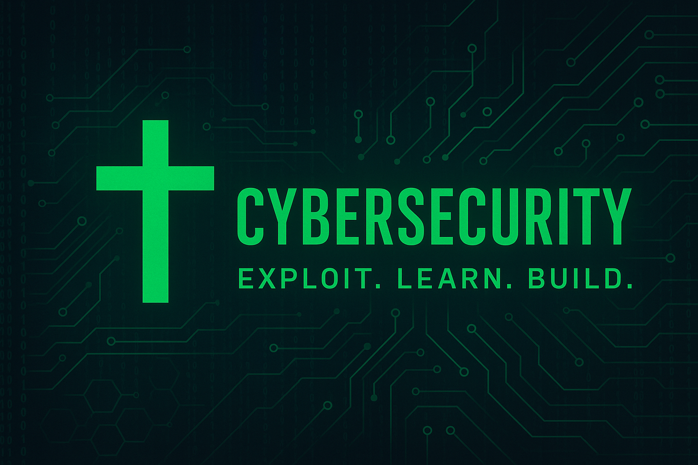



# Security Writeups — Braxton (Ben-Frank17)

This repository is a portfolio of short, reproducible security lab writeups and evidence.  
It demonstrates basic web testing skills and recon techniques performed in isolated, authorized labs (DVWA, TryHackMe).

---

## 📑 Featured Reports

- **Recon (Nmap)**
  - 📄 [Text Output](dvwa/dvwa_nmap.txt)

---
## About me
Braxton (Ben-Frank17) — cybersecurity student, USMC veteran.  
I use these labs to build repeatable testing skills and create client-ready micro-scan deliverables.

## Use & Disclaimer
All testing shown was performed in a controlled, authorized lab.  
Do not run these techniques against systems you do not own or have explicit permission to test.

## Contact
📧 Email: beck.braxton45@gmail.com  
🐙 GitHub: [Ben-Frank17](https://github.com/Ben-Frank17)

