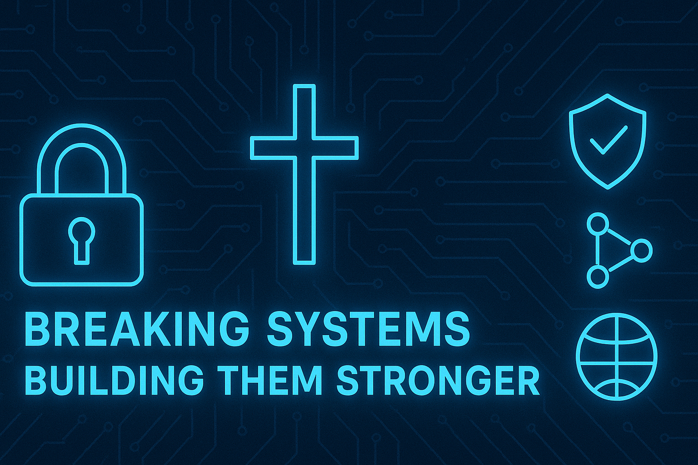
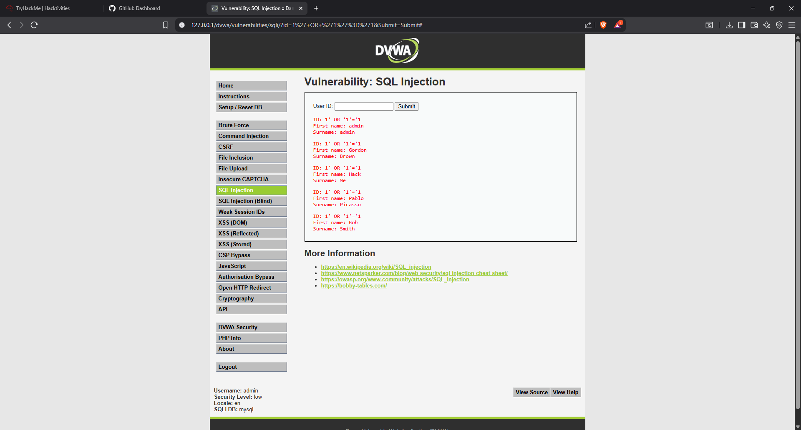
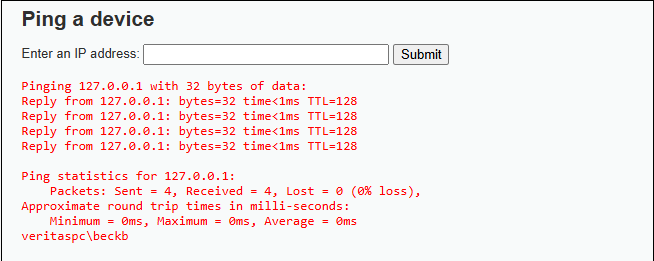
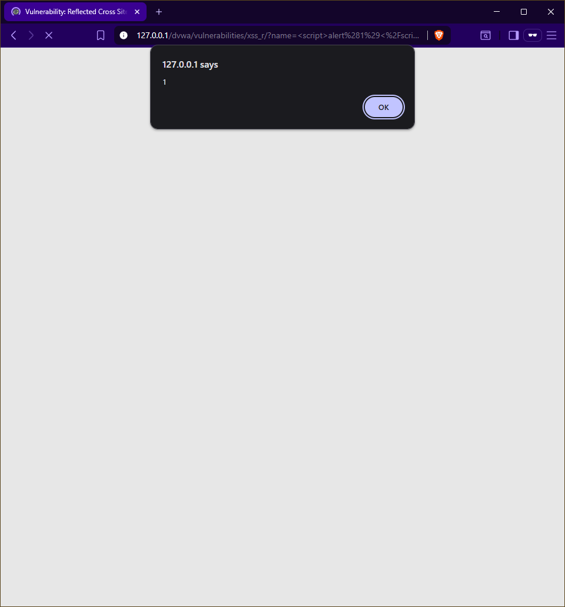
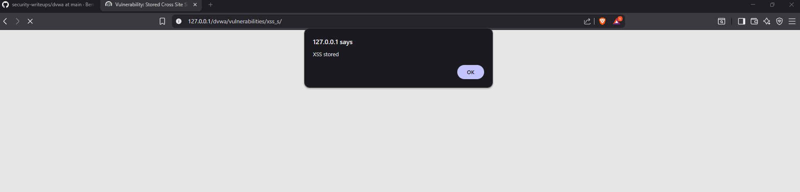

# 🔐 Security Writeups — Braxton (Ben-Frank17)

This repository is a **portfolio of reproducible security lab writeups and evidence**.  
It demonstrates web vulnerability exploitation, recon, and reporting skills performed in isolated, authorized labs (DVWA, TryHackMe).

---

## 📂 Featured Reports
- **SQL Injection** · [MD](dvwa/dvwa_sql_injection.md) · [PDF](dvwa/dvwa_sql_injection.pdf)  
  
- **Command Injection** · [MD](dvwa/dvwa_cmd_injection.md) · [PDF](dvwa/dvwa_cmd_injection.pdf)  
  
- **Reflected XSS** · [MD](dvwa/dvwa_xss_reflected.md) · [PDF](dvwa/dvwa_xss_reflected.pdf)  
  
- **Stored XSS** · [MD](dvwa/dvwa_xss_stored.md) · [PDF](dvwa/dvwa_xss_stored.pdf)  
  
- **File Upload** · [MD](dvwa/dvwa_file_upload.md) · [PDF](dvwa/dvwa_file_upload.pdf)  
  

---

## 🧭 Report Format
Each writeup follows:
- **Summary**  
- **PoC (payload + reproduction steps)**  
- **Evidence (screenshots, logs, scans)**  
- **Impact and remediation**  
- **Retest verification**

---

## 🛠 Tools & Methods
- Recon: Nmap  
- Web testing: manual testing, payloads, FFUF, sqlmap where applicable  
- Deliverables: Markdown + PDF (client-ready)

---

## 👤 About
Braxton (Ben-Frank17) — Cybersecurity student · USMC Veteran  
Email: beck.braxton45@gmail.com · GitHub: https://github.com/Ben-Frank17/security-writeups

---

## ⚠️ Disclaimer
All testing shown was performed in controlled, authorized labs. Do not run these techniques against systems you do not own or have permission to test.
