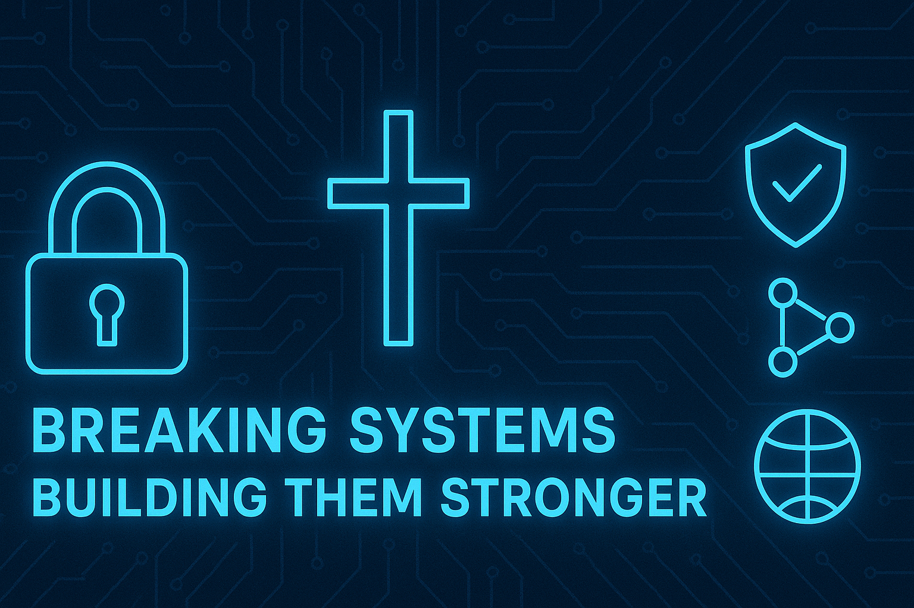

  

---

# 🔐 Security Writeups — Braxton Beck (Ben-Frank17)

> *Breaking Systems, Building Them Stronger*  
> Cybersecurity student • USMC Veteran • Aspiring Red Teamer

---

## 📊 Repo Status

---

## 📂 Featured Reports

- **SQL Injection** — [Markdown](dvwa/dvwa_sql_injection.md) • [PDF](dvwa/dvwa_sql_injection.pdf)
- **Command Injection** — [Markdown](dvwa/dvwa_cmd_injection.md) • [PDF](dvwa/dvwa_cmd_injection.pdf)
- **Reflected XSS** — [Markdown](dvwa/dvwa_xss_reflected.md) • [PDF](dvwa/dvwa_xss_reflected.pdf)
- **Stored XSS** — [Markdown](dvwa/dvwa_xss_stored.md) • [PDF](dvwa/dvwa_xss_stored.pdf)
- **File Upload** — [Markdown](dvwa/dvwa_file_upload.md) • [PDF](dvwa/dvwa_file_upload.pdf)
- **Recon (Nmap)** — [Text](dvwa/dvwa_nmap.txt)

---

## 🛠️ Tools & Skills

- Recon: Nmap, service enumeration
- Web vulns: SQLi, XSS (reflected/stored), command injection, file upload
- Reporting: Markdown → PDF exports with remediation
- Process: Git/GitHub versioned workflow

---

## 👨‍💻 About Me

I’m **Braxton Beck (Ben-Frank17)** — cybersecurity student and USMC veteran.  
I write lab findings as **client-facing deliverables**, focusing on clarity, reproducibility, and fixes.

---

## ⚠️ Disclaimer

All demonstrations are performed on **controlled, authorized labs** (DVWA, TryHackMe, etc.).  
Do not use these techniques against systems you do not own or lack explicit permission to test.

---

## 📬 Contact

- **Email:** beck.braxton45@gmail.com  
- **GitHub:** https://github.com/Ben-Frank17
