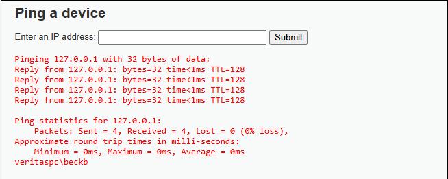

# DVWA — Command Injection (low)

**Target:** http://127.0.0.1/dvwa/vulnerabilities/exec/  
**Date:** 2025-09-26  
**Severity:** Low

## PoC
Payload used: 127.0.0.1 && whoami  
Steps:
1. Open DVWA → Vulnerabilities → Command Injection.  
2. Submit payload in IP field.  
3. Application executes shell command and returns `whoami` output `veritaspc\beckb`. (screenshot)

## Impact
Command injection allows arbitrary OS command execution.

## Fix
Validate input strictly. Use whitelists and safe libraries.
