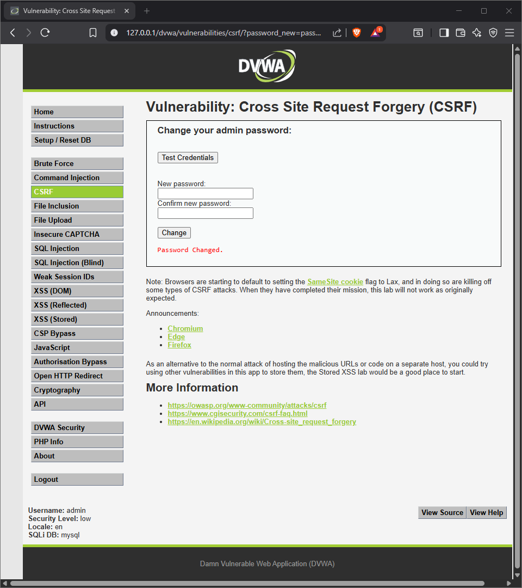

# DVWA – Cross-Site Request Forgery (CSRF) – Low

**Target:** http://127.0.0.1/dvwa/vulnerabilities/csrf/  
**Date:** 2025-09-27  
**Author:** Braxton Beck (Ben-Frank17)  
**Severity:** High  

## Summary
The password change endpoint lacks CSRF protections. A logged-in user’s browser will execute a password change request initiated from another site, allowing unauthorized password change.

## PoC (reproducible)
**Prereq:** Logged in as `admin` with DVWA Security = low.

**Payload A (GET via image):**
```html

```Evidence:

# close the here-string and write the file
